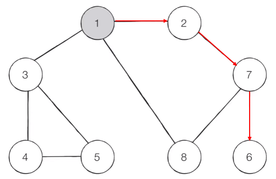
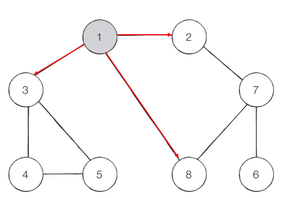

## DFS

`DFS(Depth-First Search, 깊이 우선 탐색)`는 그래프에서 깊은 부분을 우선적으로 탐색하는 알고리즘이다. 안쪽으로 파고드는 방법론이기 때문에 `Stack` 자료구조를 이용하여 구현한다. 

	Stack을 사용하지 않고 재귀적으로 구현하는 경우도 많은데, 재귀 함수도 함수의 Call Stack을 이용한 방식이라 명시적으로 Stack을 사용하지 않는 것 뿐이지 결국은 Stack이다.

### DFS 동작 방식

1. 그래프 탐색 이전에, 우선 탐색을 시작할 노드를 정해야 한다. 선택한 노드를 시작 노드라고 한다.
2. 시작 노드부터 방문 처리를 한다.
3. 방문한 노드에서 방문 하지 않은 이웃 노드를 찾고 방문한다. (처음의 경우엔 시작 노드의 이웃 노드를 확인한다.)
5. 더 이동할 수 없을 때까지 위 과정을 반복한다.
6. **백트래킹**: 더 이상 방문할 수 없는 상황이 되면 스택을 통해 이전 단계로 돌아가서 다른 노드를 방문한다. 이 과정을 인접한 모든 노드를 방문할 때까지 반복한다.



1 -> 2 -> 7 -> 6 -> 8 -> 3 -> 4 -> 5 순으로 방문한다. (이웃 노드가 여러 개이면 가장 작은 수를 먼저 선택한다는 기준)

```python
graph = [  
    [],  
    [2, 3, 8],  
    [1, 7],  
    [1, 4, 5],  
    [3, 5],  
    [3, 4],  
    [7],  
    [2, 6, 8],  
    [1, 7]  
]  
visited = [False] * 9  
  
  
def dfs(graph, v, visited):  
    visited[v] = True  
    print(v)  
    for i in graph[v]:  
        if not visited[i]:  
            dfs(graph, i, visited)  
  
  
dfs(graph, 1, visited)
# 1
# 2
# 7
# 6
# 8
# 3
# 4
# 5
```

위 그래프 탐색 과정을 구현하면 위와 같다.

## BFS

`BFS(Breath-First Search, 너비 우선 탐색)`는 그래프에서 가까운 부분부터 우선적으로 탐색하는 알고리즘이다. `DFS`와 다르게 바닥을 긁는 방식이 아니라 인접한 노드부터 탐색하며, 이러한 특성 때문에 `Queue` 자료구조를 이용해서 구현한다.

### BFS 동작 방식

1. 탐색 시작은 `DFS`와 마찬가지로 시작 노드를 정한다. 
2. 선택한 시작 노드를 큐에 넣는다.
3. 큐에 있는 노드를 꺼내 인접한 이웃 노드를 모두 방문 처리를 하고 큐에 넣는다.
4. 모든 노드를 방문할 때까지 3번 과정을 반복한다.



1 -> 2 -> 3 -> 8 -> 7 -> 4 -> 5 -> 6 순으로 방문한다.

```python
from collections import deque  
  
graph = [  
    [],  
    [2, 3, 8],  
    [1, 7],  
    [1, 4, 5],  
    [3, 5],  
    [3, 4],  
    [7],  
    [2, 6, 8],  
    [1, 7]  
]  
  
visited = [False] * 9  


def bfs(graph, start, visited):  
    queue = deque([start])  
    visited[start] = True  
  
    while queue:  
        v = queue.popleft()  
        print(v)  
        for i in graph[v]:  
            if not visited[i]:  
                queue.append(i)  
                visited[i] = True  


bfs(graph, 1, visited)
# 1
# 2
# 3
# 8
# 7
# 4
# 5
# 6
```

위 그래프 탐색 과정을 구현하면 위와 같다.

### DFS / BFS 예제

[DFS와 BFS (Silver 2)](https://www.acmicpc.net/problem/1260)

**문제**

	그래프를 DFS로 탐색한 결과와 BFS로 탐색한 결과를 출력하는 프로그램을 작성하시오. 단, 방문할 수 있는 정점이 여러 개인 경우에는 정점 번호가 작은 것을 먼저 방문하고, 더 이상 방문할 수 있는 점이 없는 경우 종료한다. 정점 번호는 1번부터 N번까지이다.

**입력**

	 첫째 줄에 정점의 개수 N(1 ≤ N ≤ 1,000), 간선의 개수 M(1 ≤ M ≤ 10,000), 탐색을 시작할 정점의 번호 V가 주어진다. 다음 M개의 줄에는 간선이 연결하는 두 정점의 번호가 주어진다. 어떤 두 정점 사이에 여러 개의 간선이 있을 수 있다. 입력으로 주어지는 간선은 양방향이다.

**출력**

	 첫째 줄에 DFS를 수행한 결과를, 그 다음 줄에는 BFS를 수행한 결과를 출력한다. V부터 방문된 점을 순서대로 출력하면 된다.

**예제 입력 1**

	4 5 1
	1 2
	1 3
	1 4
	2 4
	3 4

**예제 출력 1**

	1 2 4 3
	1 2 3 4

**예제 입력 2**

	5 5 3
	5 4
	5 2
	1 2
	3 4
	3 1

**예제 출력 2**

	3 1 2 5 4
	3 1 4 2 5

**예제 입력 3**

	1000 1 1000
	999 1000

**예제 출력 3***

	1000 999
	1000 999

`DFS`와 `BFS`의 개념을 알면 아주 쉽게 풀 수 있는 문제로, 처음 학습할 때 익히기 좋은 문제다. 입력 받은 간선을 순서대로 그래프로 작성하여 탐색한 결과를 그대로 출력하면 된다.

```python
import sys
sys.setrecursionlimit(10 ** 7)
from collections import deque

N, M, V = map(int, sys.stdin.readline().split())
graph = [[] for _ in range(N + 1)]
visitedD = [False] * (N + 1)
visitedB = [False] * (N + 1)

for _ in range(M):
    x, y = map(int, sys.stdin.readline().split())
    graph[x].append(y)
    graph[y].append(x)


def dfs(graph, v, visited):
    visited[v] = True
    print(v, end=" ")
    for i in sorted(graph[v]):
        if not visited[i]:
            dfs(graph, i, visited)


def bfs(graph, start, visited):
    visited[start] = True
    queue = deque([start])

    while queue:
        q = queue.popleft()
        print(q, end=" ")
        for i in sorted(graph[q]):
            if not visited[i]:
                visited[i] = True
                queue.append(i)


dfs(graph, V, visitedD)
print()
bfs(graph, V, visitedB)
```

그나마 이 문제에서 실수를 할만한 부분은 간선을 그래프화 하는 부분이다.

```python
for _ in range(M):
    x, y = map(int, sys.stdin.readline().split())
    graph[x].append(y)
    graph[y].append(x)
```

반드시 양쪽에 연결을 표시해야 제대로 탐색할 수 있다.

### 풀어보면 좋은 예제

[토마토 (Gold 5, 그래프 탐색)](https://www.acmicpc.net/problem/7576)
[DFS 스페셜 저지 (Gold 3)](https://www.acmicpc.net/problem/16964)

	많이 어려워용 스페셜 저지는 나중에라도 꼭 풀어보기