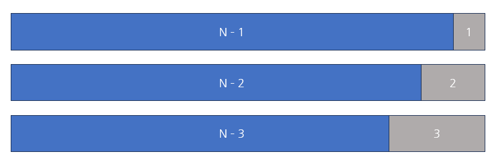

## Dynamic Programming

`Dynamic Programming(동적 계획법)`은 중복되는 부분 문제들의 해결책을 결합하여 전체 문제의 해결책은 찾는 최적화 기법이다. 특정 알고리즘으로 최적해를 구할 때 시공간적인 복잡도가 너무 커져서 연산 속도와 메모리 공간을 최대한으로 활용하고자 설계된 방법론이다.

	최적해를 구하는 알고리즘 중 DP와 크게 비교되는 것은 Brute Force나 Recursive 등이 있다. 

`DP`로 쉽게 최적해를 구할 수 있는 예시에는 피보나치 수열이 있다. 후에 설명하겠지만 `DP` 문제 풀이에 있어서는 항 간의 관계를 파악해서 점화식을 세워 풀이를 해야 하는데, 피보나치 수열이 이를 설명하기 적합하다.

```python
def fibo(x):
	if x == 0 or x == 1:
		return x
	return fibo(x - 1) + fibo(x - 2)
```

기존의 방법으로 재귀 함수를 이용하여 호출하는 방식이다. 

$$ a(n) = a(n-1) + a(n-2) \quad \text{for } n \geq 2 $$

주어지는 인자에 따라서 모든 하위 문제들을 조합하여 해를 구하는 방식이다. 다만 실제로 실행시켜보면 알겠지만 항의 수가 커짐에 따라 연산 시간이 기하급수적으로 올라간다. 실제로 사용하기에 크게 무리가 있는 구현 방식이라는 것을 알 수 있다. 

`DP`에서는 이런 문제를 쉽게 해결 할 수 있는데, 재귀 방식이 크게 느릴 수 밖에 없는 이유는 이미 계산한 모든 값을 다시 계산한다는 부분이다. `DP`는 이 문제를 해결하면서 메모리와 연산 속도에서 크게 이득을 볼 수 있다.

```python
d = [0] * (N + 1)

def fibo(x):
	if x == 0 or x == 1:
		return x
	if d[x] != 0:
		return d[x]
	d[x] = fibo(x - 1)  fibo(x - 2)
	return d[x]	
```

재귀 방식에선 `a(50)`을 구하는 것도 결과를 보기 어려울 만큼 연산 속도가 느렸지만, `DP`를 이용하면 순식간에 해를 도출해낸다.

다만 `DP`는 `Greedy Algorithm`과 마찬가지로 전제 조건이 있는데, **최적 부분 구조**와 **중복 부분 문제**를 만족해야 한다. 즉, 부분의 최적해를 통해 전체의 최적해를 도출해 낼 수 있어야 하며 작은 부분 문제들이 여러 번 반복되는 경우에 사용할 수 있다.

### Top-down (Memoization)

`DP`를 구현하는 방식은 크게 두 개가 있다. 일반적으로 말하는 `메모이제이션`은 하향식 방식인 `Top-down`이다. 큰 문제를 해결하기 위해서 부분 문제를 기록하며 해결한다. 이렇게 하면 중복 문제를 다시 계산할 필요 없이 효율적으로 계산할 수 있다.

보통 구현 시 재귀적으로 구현하게 되며 위의 피보나치 수열이 대표적인 `메모이제이션` 예제다.
### Bottom-up (Tabulation)

`Bottom-up` 방식은 상향식으로 작은 문제에서 시작하여 전체 문제의 해를 구하는 과정을 말한다. 일반적으로 반복문을 통해 구현하게 된다.

```python
import sys  
sys.setrecursionlimit(10**6)  
  
N = int(sys.stdin.readline().rstrip())  
d = [0] * (N + 1)  
d[1] = 1  
d[2] = 1  
  
for i in range(3, N + 1):  
    d[i] = d[i - 1] + d[i - 2]  
  
print(d[N])
```

상향식으로 피보나치 수열의 특정 항을 구하는 예시다.

필요에 따라서 하향식으로 문제를 해결해야 하는 경우도 있고 상향식으로 해결해야 하는 경우도 있으니 문제에 따라서 잘 선택하는 편이 좋다.

### Dynamic Programming 예제

[1, 2, 3 더하기](https://www.acmicpc.net/problem/9095)

**문제**

	정수 4를 1, 2, 3의 합으로 나타내는 방법은 총 7가지가 있다. 합을 나타낼 때는 수를 1개 이상 사용해야 한다.
	
	- 1+1+1+1
	- 1+1+2
	- 1+2+1
	- 2+1+1
	- 2+2
	- 1+3
	- 3+1
	
	정수 n이 주어졌을 때, n을 1, 2, 3의 합으로 나타내는 방법의 수를 구하는 프로그램을 작성하시오.

**입력**

	첫째 줄에 테스트 케이스의 개수 T가 주어진다. 각 테스트 케이스는 한 줄로 이루어져 있고, 정수 n이 주어진다. n은 양수이며 11보다 작다.

**출력**

	각 테스트 케이스마다, n을 1, 2, 3의 합으로 나타내는 방법의 수를 출력한다.

**예제 입력 1**

	3
	4
	7
	10

**예제 출력 1**

	7
	44
	274

일반적인 `DP` 문제의 유형으로, 주어지는 입력 값 `N`에 따라서 `a(N)`을 구하는 문제다.
문제의 아이디어는 간단하다. 정수 `N`을 1, 2, 3을 통해서 표현하는 방법의 가지 수를 구해야 하는 문제인데, 인접 항들의 관계와 관련하여 생각하면 간단하게 풀이 할 수 있다. 



`N`번째 경우에 마지막에 올 수 있는 숫자는 1, 2, 3 3가지 뿐이고 그 숫자를 막는 경우에는 각각 길이가 `N-1`, `N-2`, `N-3`이 되어 그 경우만 계산하면 풀이할 수 있다. 즉 가장 작은 수에서 시작해서 `N`번 항을 추론하는 방식으로 작성하여 풀이가 가능하다.

이때, 이 아이디어를 수식으로 정리하면 다음과 같다.

$$ a(n) = a(n-1) + a(n-2) + a(n-3) \quad \text{for } n \geq 4 $$

```python
import sys  
  
N = int(sys.stdin.readline().rstrip())  
case = [int(sys.stdin.readline().rstrip()) for _ in range(N)]  
  
memo = [0, 1, 2, 4]  
  
if max(case) >= 4:  
    for i in range(4, max(case) + 1):  
        memo.append(memo[i - 3] + memo[i - 2] + memo[i - 1])  
  
for c in case:  
    print(memo[c])
```

이런 아이디어를 떠올리는 능력은 문제를 많이 풀어봐야 기를 수 있기 때문에 꾸준히 문제를 풀어보는 편이 좋다.

### 풀어보면 좋은 예제

[동전 1 (Gold 5)](# https://www.acmicpc.net/problem/2293)
