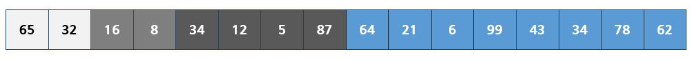
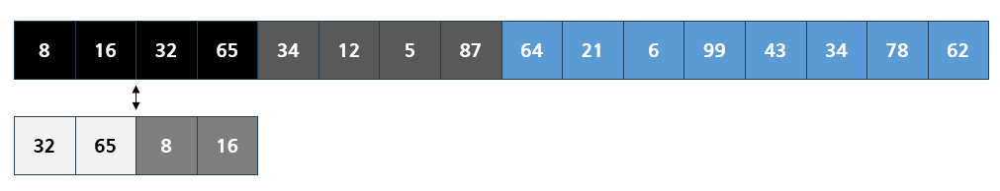

## Divide and Conquer (분할 정복)

`Divide and Conquer(분할 정복)`은 큰 문제를 부분 문제로 분할하여 해결하는 알고리즘 설계 기법이다. 문제를 더 분할 할 수 없을 수준까지 작게 만들어 그 부분 문제들을 해결한 뒤 조합하여 큰 문제의 해를 얻는 방법이다.

`분할 정복`은 3가지 단계로 문제를 해결한다.

1. `Divide (분할)`: 주어진 문제를 더 작은 부분으로 분할하는 과정이다. 해결해야 할 문제의 규칙에 따라서 나누는 과정이 된다.
2. `Conquer (정복)`: 나눠진 작은 부분 문제들을 재귀적으로 해결한다. 문제를 더 분할 할 수 없는 경우에는 직접 해결한다.
3. `Combine (통합)`: 작은 문제들의 해결책을 조합하여 큰 문제의 해결책을 얻는다.

### Merge Sort

`분할 정복`을 대표적으로 해결하는 예시는 `Merge Sort`가 있다. 주어진 충분히 작게 분할하여 정렬을 하고 부분 배열들을 병합하여 전체 배열을 정렬한다. 이 때, 배열을 반복하여 반으로 쪼개는 방식으로 동작하기 때문에 이 과정의 시간 복잡도는 `O(logN)`을 가진다. 이후 통합 과정까지 거치면 `O(NlogN)`의 시간 복잡도를 가지게 된다.

이러한 전체 문제를 아래와 같이 분할하여 풀이한다.

이렇게 자를 수 있는 최소 크기만큼 자르고 그 안에서 정렬을 하기 시작한다.

이렇게 가장 작은 부분 배열을 정렬하고, 합쳐서 더 큰 부분 배열을 만들어가며 정렬을 진행한다. 이와 같은 방식을 `Divide and Conquer`라고 한다.

### 분할 정복 예제

[종이의 개수 (Silver 2)](https://www.acmicpc.net/problem/1780)

**문제**

	N×N크기의 행렬로 표현되는 종이가 있다. 종이의 각 칸에는 -1, 0, 1 중 하나가 저장되어 있다. 우리는 이 행렬을 다음과 같은 규칙에 따라 적절한 크기로 자르려고 한다.
	
	1. 만약 종이가 모두 같은 수로 되어 있다면 이 종이를 그대로 사용한다.
	2. (1)이 아닌 경우에는 종이를 같은 크기의 종이 9개로 자르고, 각각의 잘린 종이에 대해서 (1)의 과정을 반복한다.
	
	이와 같이 종이를 잘랐을 때, -1로만 채워진 종이의 개수, 0으로만 채워진 종이의 개수, 1로만 채워진 종이의 개수를 구해내는 프로그램을 작성하시오.

**입력**

	첫째 줄에 N(1 ≤ N ≤ 37, N은 3k 꼴)이 주어진다. 다음 N개의 줄에는 N개의 정수로 행렬이 주어진다.

**출력**

	첫째 줄에 -1로만 채워진 종이의 개수를, 둘째 줄에 0으로만 채워진 종이의 개수를, 셋째 줄에 1로만 채워진 종이의 개수를 출력한다.

**예제 입력 1**

	9
	0 0 0 1 1 1 -1 -1 -1
	0 0 0 1 1 1 -1 -1 -1
	0 0 0 1 1 1 -1 -1 -1
	1 1 1 0 0 0 0 0 0
	1 1 1 0 0 0 0 0 0
	1 1 1 0 0 0 0 0 0
	0 1 -1 0 1 -1 0 1 -1
	0 -1 1 0 1 -1 0 1 -1
	0 1 -1 1 0 -1 0 1 -1

**예제 출력 1**

	10
	12
	11

문제 설명을 읽어보면 모두 같은 수가 아니라면, 종이를 9개로 분할하여 다시 검사하도록 명시했다. 그렇다면 각 9개의 종이도 위와 같은 과정을 거치는데, 더 분할 할 수 없는 경우까지 반복하면 된다. (분할 한 결과의 종의아)