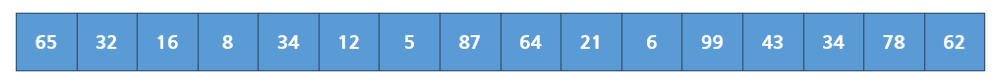

`Divide and Conquer(분할 정복)`은 큰 문제를 부분 문제로 분할하여 해결하는 알고리즘 설계 기법이다. 문제를 더 분할 할 수 없을 수준까지 작게 만들어 그 부분 문제들을 해결한 뒤 조합하여 큰 문제의 해를 얻는 방법이다.

`분할 정복`은 3가지 단계로 문제를 해결한다.

1. `Divide (분할)`: 주어진 문제를 더 작은 부분으로 분할하는 과정이다. 해결해야 할 문제의 규칙에 따라서 나누는 과정이 된다.
2. `Conquer (정복)`: 나눠진 작은 부분 문제들을 재귀적으로 해결한다. 문제를 더 분할 할 수 없는 경우에는 직접 해결한다.
3. `Combine (통합)`: 작은 문제들의 해결책을 조합하여 큰 문제의 해결책을 얻는다.

### Merge Sort

`분할 정복`을 대표적으로 해결하는 예시는 `Merge Sort`가 있다. 주어진 충분히 작게 분할하여 정렬을 하고 부분 배열들을 병합하여 전체 배열을 정렬한다. 이 때, 배열을 반복하여 반으로 쪼개는 방식으로 동작하기 때문에 이 과정의 시간 복잡도는 `O(logN)`을 가진다. 이후 통합 과정까지 거치면 `O(NlogN)`의 시간 복잡도를 가지게 된다.

이러한 전체 문제를 아래와 같이 분할하여 풀이한다.

이렇게 자를 수 있는 최소 크기만큼 자르고 그 안에서 정렬을 하기 시작한다.

이렇게 가장 작은 부분 배열을 정렬하고, 합쳐서 더 큰 부분 배열을 만들어가며 정렬을 진행한다. 이와 같은 방식을 `Divide and Conquer`라고 한다.

