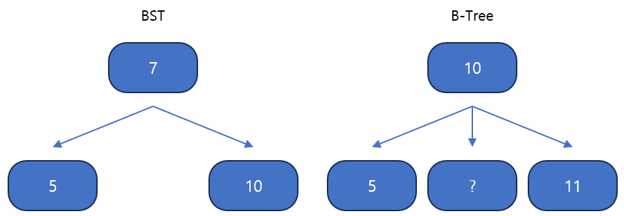
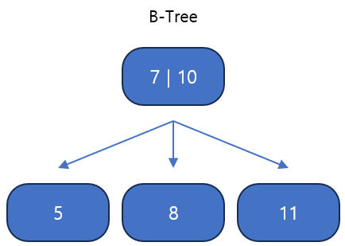

## B-Tree

`B-Tree`는 정렬을 유지한 `Tree` 자료구조의 일종으로, `Binary Search Tree`의 확장 개념이라고 볼 수도 있다. 다만 `Binary Tree`의 구조와 다르게 자식 노드의 최대 개수가 2보다 크다는 점이 `B-Tree`의 핵심 구조이다.

`BST`는 부모 노드를 기준으로 양쪽에 특정한 기준으로 정렬을 했는데, 그렇다면 `B-Tree`는 어떻게 정렬을 해야 할까? `B-Tree`도 마찬가지로 한 방향으로 정렬되어야 하는데 이 부분에서 이해하기 어렵다.

위와 같이 부모 노드에 두 개의 값을 넣으면 정렬을 유지하면서도 자식 노드의 수가 2보다 크게 할 수 있다. 

즉 `B-Tree`의 핵심은 모든 부모 노드는 오름차순으로 정렬된 하나 이상의 `key`를 가지며, 부모 노드의 `key`에 따라서 자녀 노드들의 `key`의 개수 범위가 정해진다는 것이다. 

즉, 부모 노드의 `key`의 개수가 `M - 1`개라고 한다면 자식 노드의 수는 최대 `M`개가 된다. 또한 자식 노드들은 순차적으로 정렬된 부모 노드의 `key`값들에 의해 범위가 정해진다.

예를 들어, 부모 노드의 `key`값이 `[3, 5, 7]`인 경우에는 모든 자식 노드가 채워져 있다고 할 때, 자식 노드들의 범위는 각각 `R < 3, 3 < R < 5, 5 < R < 7, R > 7`이 된다.

	B-Tree의 최대 자녀 수가 M일 때, 그 B-Tree는 M차 B-Tree라고 부른다.
	이 때, B-Tree는 몇 개의 파라미터를 가진다.
	
	- M: 각 노드의 최대 자녀 노드의 수
	- M-1: 각 노드의 최대 key의 수
	- ⌈ M/2 ⌉: 각 노드의 최소 자녀 노드의 수 *루트 노드, 리프 노드 제외
	- ⌈ M/2 ⌉-1: 각 노드의 최소 key의 수 *루트 노드 제외

### B-Tree의 데이터 삽입

	B-Tree에서 데이터 삽입 시 추가는 항상 리프 노드에 한다.
	만약 데이터 삽입 중 노드가 넘치면 가운데 key를 기준으로 좌우 key를 분할하고 가운데 key는 승진한다.

**[B-Tree 데이터 삽입 과정](../etc/btree.pptx)**

삽입 과정에서 알 수 있는 사실은, `B-Tree`의 모든 리프 노드는 같은 레벨에 있을 수 밖에 없다.

또한, 삽입 진행 시 데이터 조회를 진행하게 되는데 이 경우 트리의 높이만큼만 연산을 진행하기 때문에 최악의 경우에도 `O(logN)`의 시간 복잡도를 보인다. 다만 삽입 시에는 새로운 데이터를 리프 노드에 추가하게 되는데, 루트 노드부터 시작하여 리프 노드까지 데이터의 위치를 찾기 때문에 평균적인 경우에도 정확하게 시간 복잡도가 `O(logN)`이 된다.

### B-Tree의 데이터 삭제

	B-Tree의 데이터 삭제도 마찬가지르 리프 노드에서 이루어진다.

삽입 시와 마찬가지로 데이터 조회를 먼저 진행하게 된다. 이후 원하는 데이터의 위치를 찾고 삭제를 진행하게 되는데 이 때 문제가 발생할 수 있다. 

삭제 이후 데이터가 위치한 노드가 최소 `key`의 수를 만족한다면 다행이지만, 그렇지 않은 경우가 발생할 수 있다. 그 경우에는 `B-Tree`의 재조정이 필요하고 그 재조정 방식을 설명하도록 한다.

#### 데이터 삭제 후 문제 발생 시 해결 방법 (1)

	1. key 수가 여유있는 형제의 지원을 받는다. (형제는 같은 부모를 둔 리프 노드를 말함)
	1.1. 동생(왼쪽 형제)이 여유가 있는 경우
	    -> 동생의 가장 큰 key를 부모 노드에서 나와 동생 사이에 위치하는 곳에 둔다.
	    -> 원래 그 자리에 있던 key는 나의 가장 왼쪽에 둔다
	1.2. 동생이 여유가 없고, 형(오른쪽 형제)이 여유가 있는 경우
	    -> 형의 가장 작은 key를 부모 노드에서 나와 형 사이에 위치하는 곳에 둔다.
	    -> 원래 그 자리에 있던 key는 나의 가장 오른쪽에 둔다.

위와 같은 방식으로 최소 `key`의 수를 만족시키기 위해 우선 형제의 도움을 받는 방법이 있다. 만약 형제의 도움을 받을 수 없는 경우에는 다음과 같은 방법으로 해결한다.

#### 데이터 삭제 후 문제 발생 시 해결 방법 (2)

	2. 형제의 지원이 불가능하면 부모의 지원을 받고 형제와 병합한다.
	2.1. 동생이 있는 경우
	    -> 부모 노드에서 나와 동생 사이에 위치하는 key를 받는다.
	    -> 그 key와 나의 key를 순서대로 동생에게 모두 옮긴다. (병합 과정)
	    -> 나의 노드를 삭제한다
	2.2. 동생이 없는 경우
	    -> 부모 노드에서 나와 형 사이에 위치하는 key를 받는다.
	    -> 그 key와 형의 key를 순서대로 나에게 옮긴다. (병합 과정)
	    -> 형의 노드를 삭제한다.

형제가 여유가 없는 경우에는 부모의 도움을 받아 형제와 같은 노드에서 살게 된다. 하지만 부모가 여유가 없는 경우도 존재하는데, 일단 지원을 받고 문제가 생긴 부모 노드를 해결해야 한다.

#### 데이터 삭제 후 문제 발생 시 해결 방법 (3)

	3. 부모의 문제를 해결하기 위해 부모도 위와 같은 과정을 밟아야 한다.
	3.1. 부모가 루트 노드가 아닌 경우
	    -> 그 위치에서부터 1번부터 재조정을 시작한다. (자신의 형제, 부모에게 지원을 받는 방식)
	3.2. 부모가 루트 노드이며 비어있는 경우
	    -> 부모 노드를 삭제한다.
	    -> 직전에 합쳐진 노드를 루트 노드로 한다.

여기서 바뀐 루트 노드의 경우에는 최소 `key`의 조건을 충족하지 못 할 수도 있다. 다만 위에서 봤던 파라미터에서 최소 `key`의 수는 부모 노드의 경우에는 예외기 때문에 넘어간다.