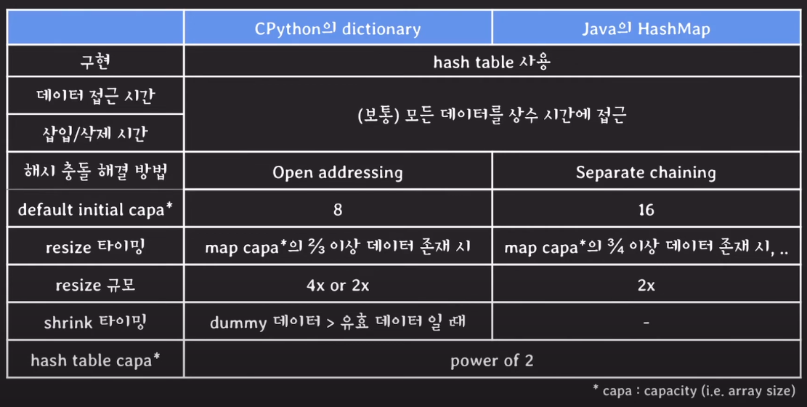

## Hash Table

`Hash Table`은 배열과 해시 함수를 사용하여 `Map`을 구현한 자료구조를 말한다. 대부분의 경우 상수 시간으로 데이터에 접근 가능하기 때문에 효율적이다.
### Map

`Map` 자료구조는 `key-value` 쌍을 저장하는 추상 데이터 타입이다. 같은 `key`를 저장하지 않는 게 가장 큰 특징이다. 일반적으로 유일한 값을 `key`로, 그와 매칭되는 값을 `value`로 매칭시키는 경우나 카운팅 등의 경우에서 유용하게 사용될 수 있다.

### Hash Function

해시 함수는 임의의 크기를 가지는 타입의 데이터를 고정된 크기를 가지는 타입의 데이터로 변환하는 함수를 말한다. `Hash Table`에서는 임의의 데이터를 정수로 변환하는 함수가 된다.

### 다시 Hash Table

그래서 이 `Hash Table`은 어떻게 동작하는가를 보면, 우선 `key`를 `Hash Function`을 통해 정수로 변환한 후에 배열에 저장한다. 다만 배열에는 길이가 존재하기 때문의 배열의 길이를 `capacity`라고 하고, `hash % capacity`와 같이 연산하여 나온 결과의 인덱스에 데이터를 저장한다. 이 때, 저장되는 공간을 해시 버킷이라고 한다.

그런데 이 경우 `Hash collision(해시값 충돌)`이 일어날 수 있다. 해싱 알고리즘의 문제로 `key`가 다른데도 `hash`가 같을 수도 있고, `key`도 다르고 `hash`도 다른데 `hash % capacity`가 같아서 문제가 발생할 수도 있다.

### Hash collision 해결 방법

#### Separate chaining

`Separate chaining(개별 체이닝)`은 위에서 말했던 충돌 상황을 해결하기 위한 방법 중 하나다. 이 방법은 `LinkedList`와 같은 방식으로 데이터를 체이닝하여 충돌을 해결한다.

	예를 들어, separate와 collision이라는 문자열을 해싱했을 때 hash % capacity의 결과가 같다고 해보자. 우선 Hash Table에 ('separate', 1234)와 같이 저장을 한다. 이 때 저장되는 위치를 1번 index 라고 해보자. 
	
	이후에 ('collision', 4321)과 같은 데이터를 저장하려고 할 때 마찬가지로 hash % capacity의 결과가 1이고 Hash Table에 저장하고자 할 때 이미 ('separate', 1234)라는 데이터가 저장되어 있음을 알 수 있고 Hash Table은 우선 키 값을 비교한다. (만약 키 값이 같은 경우에는 데이터를 수정하려는 시도기 때문에 Separate chaining이 아니더라도 비교를 하는게 맞다.
	
	하지만, 여기서 비교한 결과는 다르고 Hash collision이 일어났음을 알았기에 별개로 데이터를 저장해야 한다. 그래서 사용하는 방식이 해당 해시 버킷에 있는 LinkedList를 이용하여 ('separate', 1234) 뒤에 ('collision', 4321)을 저장하는 것이다.
	
	그럼 이후에 이 중복되는 키를 통하여 데이터를 어떻게 조회할지 생각해 볼 수 있는데, 같은 방법으로 데이터를 조회한다. 키 값을 해싱한 이후 indexing하여 바로 값을 가져오는게 아니라 키 값을 먼저 비교해보고 맞는 경우에만 가져오도록 한다. (수정의 경우와 마찬가지로 Separate chaining이 아니더라도 비교를 해야 하는데, Hash collision 문제로 Table에 존재하지 않는 키값이 indexing이 됐을 경우도 존재하기 때문이다.)

#### Open addressing (Linear probing)

`Open addressing(개방 주소법)`은 위의 `Separate chaining`과 다르게 `LinkedList`와 같은 별도의 자료구조를 사용하지 않고 직접 데이터를 저장한다. 이 때 `Hash collision`이 발생하는 경우에는 그냥 다른 빈 해시 버킷에 데이터를 저장한다. 

그리고 이렇게 문제가 발생한 데이터가 제거되는 경우 `collision`이 일어난 데이터를 원래 자리로 이동시키거나 더미 데이터라도 저장해야 한다. 만약 더미 데이터도 저장하지 않고 버킷을 비워버리는 경우에는 `collision`이 일어난 데이터가 존재하지 않는 것으로 판단될 수 있기 때문이다. 

하지만 개방 주소법은 문제가 존재하는데, 클러스터링이라는 문제점이 존재한다. 만약 특정 데이터를 저장하려고 할 때, `collision`이 발생하여 다른 버킷에 저장하고 그 위치에 새로운 데이터가 저장되려고 하는 상황을 말한다. 이 경우 또 다른 버킷에 저장하여 문제가 해결된다면 다행이지만 그렇지 않은 경우 (계속해서 `collision`을 일으키는 경우)는 영구적인 클러스터링이라고 하여 성능 저하가 일어난다. 

이렇게 문제가 발생하면 `Linear probing`이 아닌 `Open addressing`을 구현하는 다른 수단(`Quadratic probing` 또는 `Double hashing` 등)을 사용하여 해결한다.

하지만 일반적으로 `Separate chaining`를 이용하여 구현하는데, 구현 방식이 간단하고 유연성이 높다는 장점이 존재하기 때문이다. 다만 상황에 따라서 자원을 중요시 여기는 경우에는 `Open addressing`을 이용하는데, 메모리 부분에서도 이점이 있으며 캐싱으로 성능 또한 개선되기 때문에 유리한 부분도 존재한다. 다만 클러스터링을 고려하여 구현하여야 한다.

### Table resizing

만약, `Hash Table`이 과부하 되는 경우에는 `capacity`를 늘리기 위한 재생성이 필요한데, 이 경우 데이터의 이전 작업을 할 때 구현한 방식에 따라서 다르게 동작할 수 있다.

`Open addressing`의 경우에는 `Hash Table`에 `key-value`만 저장하는 게 아니라 데이터를 저장할 때 계산했던 `hash`도 포함하여 계산한다. 그렇기에 `resize` 과정에서 이미 계산했던 `hash`를 통하여 `hash % capacity`를 계산하여 재배열 한다. 

하지만 `Separate chaining`의 경우에는 구현에 따라 다시 `hash`를 계산하고 그 값을 가지고 `hash % capacity`를 계산하여 재배열 할 수도 있다. 

*자료 출처: [Youtube] 쉬운코드 - [맵(map)과 해시 테이블(hash table) 핵심만 모아보기! 맵과 해시 테이블(a.k.a 해시 맵)을 20분간 아주아주아주 알차게 설명합니다!!](https://www.youtube.com/watch?v=ZBu_slSH5Sk)*

사용하는 언어에 따라서 위와 같이 구현 방식이 다 다르므로 본인이 사용하는 언어는 어떻게 구현했는지 알아보면 도움이 될 수 있다.
