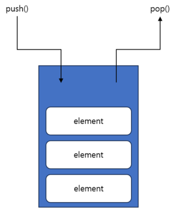

## Stack

`Stack` 자료구조는 대표적인 선형 자료구조로, 가장 마지막에 저장한 데이터가 가장 먼저 삭제되는 Last In First Out (LIFO) 구조의 자료구조다. 가장 마지막에 저장된 데이터를 `top`이라고 한다.

간단한 구조로, 어떤 동작을 해도 `O(1)`의 시간 복잡도를 가진다. 

`Stack`은 한 방향에서만 조회, 삽입 및 삭제만 가능한 자료구조다. 그래서 만약 `top` 아래에 있는 원소를 조회하고 싶다면 그 원소가 나올 때까지 `pop`을 하여 꺼내야만 한다는 단점이 있다. 이러한 경우에는 최악의 경우에 `O(N)`의 시간 복잡도를 가질 수 있다.

## Queue

`Queue` 또한 `Stack`과 마찬가지로 대표적인 선형 자료구조이다. Stack과는 다르게 양쪽 방향이 열려있으며 가장 먼저 저장한 데이터가 가장 먼저 나오는 First In First Out (FIFO) 구조의 자료구조이다. 가장 먼저 저장한 데이터를 `front`, 가장 마지막에 저장한 데이터를 `rear`라고 한다.

`Queue` 또한 `Stack`과 마찬가지로 어떤 동작을 해도 `O(1)`의 시간 복잡도를 가진다.

단점 또한 마찬가지로, `front`나 `rear`가 아닌 중간에 있는 데이터를 조회하기 위해서는 그 원소를 찾을 때 까지 `pop`을 해야한다. 이 경우에도 최악의 경우 `O(N)`의 시간 복잡도를 가진다.

`Linear Queue` 외에도 `Circular Queue`가 있는데, 같은 개념으로 동작하기에 생략한다.

## Deque

`Deque (Double Ended Queue)`는 `Queue`를 확장하여 구현된 자료구조로, `Stack`과 `Queue`의 특징을 모두 가지고 있다는 특징이 있다. 방금 넣은 값을 바로 꺼낼 수도 있고 (FIFO), 마지막에 넣은 값을 바로 꺼낼 수도 있는 (LIFO) 구조이다.

`push()`, `pop()`에 더하여 `pushleft()`, `popleft()`를 통해 양쪽에 원하는 대로 자료를 삽입 및 삭제를 편하게 할 수 있으며, 인덱싱 기능 또한 지원하여 완벽하게 `O(1)`의 시간 복잡도를 가지는 구조다.

#### 번외

위에서 설명한 모든 자료구조는 쉽고, 대부분이 아는 자료구조지만 특수한 경우에 유용하게 활용되기에 설명할 수 있을 정도로는 알고 있는 편이 좋다.

단편적으로 알고리즘만 봐도 깊이 우선 탐색(DFS), 너비 우선 탐색(BFS)이 위에서 말한 `Stack`과 `Queue`를 활용하기 때문에 반드시 알고 넘어가야 한다.