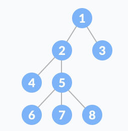

`Tree`는 하나 이상의 노드를 갖는 집합이다. `Tree`는 반드시 루트 노드를 가져야 하고, **원소가 중복되지 않는** 여러 개의 `Sub Tree`로 구성된다. 

	**Tree와 관련된 용어**
	
	- 루트 노드 (Root node): 최상위 노드 (위 사진에서 맨 위의 1에 해당)
	- 단말 노드 (Leaf node): 자식이 없는 노드 (위 사진에서 3, 4, 6, 7, 8에 해당)
	- 크기 (Size): 모든 노드의 개수 (위 사진에서 Size == 8)
	- 깊이 (Depth): 루트 노드에서부터의 거리 (위 사진에서 2는 1, 5는 2, 7은 3)
	- 차수: 자식 노드의 개수
	
	이외에 내부 노드 (Internal Node) (단말 노드의 반대), 
	형제 (Sibling) (같은 부모를 가지는 노드) 등이 있다.

`Tree`는 계층적인 구조를 효율적으로 표현할 수 있다는 특징을 가진다. 예시로 파일 시스템의 디렉토리 구조나 조직의 구조 등이 `Tree` 구조라고 볼 수 있다.

또한, `Tree`의 기본적인 성질로 크기가 `N`개인 `Tree`는 항상 `N-1`개의 링크를 가진다는 점이 있다.

## Binary Tree

`이진 트리(Binary Tree)`는 각 노드가 최대 두 개의 자식 노드를 가지는 `Tree` 구조를 말한다.  위 사진의 `Tree`는 5번 노드 아래에 3개의 노드가 있으므로, `Binary Tree`로 보기 어렵다.

`Binary Tree`는 여러 개의 종류로 나뉘어져 있는데, 아래에서 알아보도록 한다.

### Binary Search Tree

`Binary Search Tree (이진 탐색 트리)`는 기존의 `Binary Search`가 동작할 수 있도록 구현된 자료구조다. 간단하게 보면 깊이에 상관 없이 맨 왼쪽 노드가 가장 작고, 맨 오른쪽 노드가 가장 크다. 

	BST의 원소의 크기
	왼쪽 자신 노드 < 부모 노드 < 오른쪽 자식 노드

위의 조건을 지키면 위 사진과 같은 모양의 `Tree`를 얻을 수 있다.

`BST`는 삽입, 삭제, 조회의 모든 과정에서 `Binary Search`가 가능하여 트리의 높이 만큼만 순회하기 때문에 최악의 경우 `O(logN)`의 시간 복잡도를 가질 수 있다. 예외적으로 일반적인 `Tree`의 구조가 아니라 `Skewed Binary Tree`의 구조에서는 최악의 경우 `O(N)`의 시간 복잡도를 가진다.

### 이외에 다양한 Binary Tree들

- `Full Binary Tree(정 이진 트리)`는 모든 노드가 0개 또는 2개의 자식 노드를 가진다.
- `Complete Binary Tree(완전 이진 트리)`는 마지막 레벨을 제외하고 모든 레벨이 채워져 있다.
- `Complete Binary Search Tree(완전 이진 탐색 트리)`는 `Binary Search Tree`의 조건을 지킨 `Complete Binary Tree`이다.
- `Perfect Binary Tree(포화 이진 트리)`는 모든 노드가 2개의 자식을 가지고, 동일한 깊이를 가진다.
- `Skewed Binary Tree`는 모든 노드가 왼쪽에만 있거나 오른쪽에만 있다. `LinkedList`와 유사하다고 볼 수 있다.

